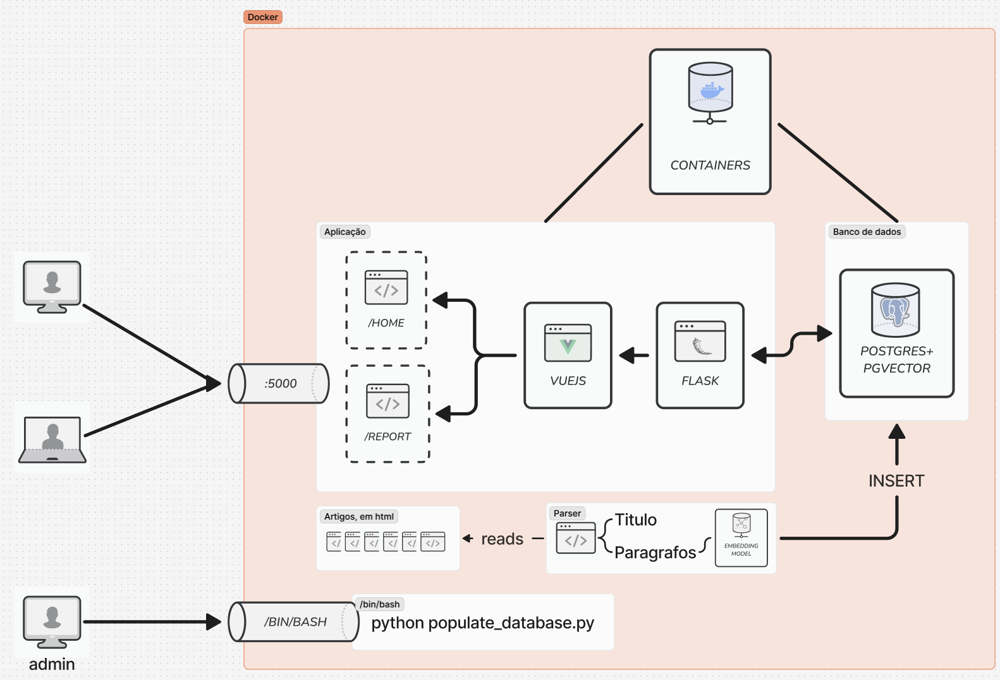
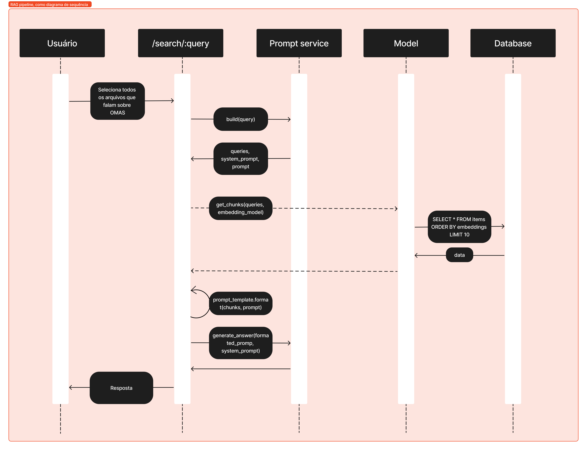

# pgvector + python

## How to run this

Firstly, clone the repo using the command below

```
git clone git@github.com:bruno-braga/pgvector-docker.git
cd pgvector-docker
```

After inside the folder do

```
docker-compose up -d
```

Then the images will be downloaded and the containers will be up.

Also, initpgvector.sql will create the extension properly onto the DB_DATABASE and also add a table with some data as example.

## What do you need to run this project?

- Docker
- Follow the instructions above
- An valid OpenAI API key
    - Set the OPENAI_API_KEY environment variable in the .env file
- Add the articles in the proper folder according ot is database (i.e /articles/scientificdirect)
- Go inside the python docker container
- Run python populate_database.py file

## Folder structure & System "Architecture"



├── app/
│   ├── rag/
│   │   ├── articles/
│   │   │   └── scientificdirect/
│   │   ├── api.py
│   │   ├── app.py  
│   │   ├── db.py
│   │   ├── parser.py
│   │   ├── populate_database.py
│   │   ├── populatedb.png
│   │   ├── prompt_template.yml
│   │   ├── prompt.py
│   │   ├── README.md
│   │   ├── strategy.png
│   │   └── strategy_png.png
│   └── src/
│       ├── .pytest_cache/
│       ├── database/
│       ├── Http/
│       ├── models/
│       ├── services/
│       │   ├── embedding_service.py
│       │   ├── prompt_service.py
│       │   └── prompt_template.yml
│       ├── static/
│       ├── tests/
│       ├── api.py
│       └── runner.py

the /rag folder is where the first experiments have happened. In there right now there are two files there that are being used, they are:

- populate_database.py
- parser.py

populate_database.py is responsible for reading the /articles folder and populate the database.
parser.py is responsible for ready the html files and extract the text from them.

/src is where the project itself lives, which is, a Flask app built with Vuejs for its frontend.

/database returns an db singleton
/Http is our controllers(Blueprints in Flask)
/models is where we have our models
/services is where we have our services
/static is where we have our static files
/api.py is our main entry point
/runner.py is our main runner

## RAG Pipeline

The diagram below illustrates the RAG pipeline as a sequence diagram.



