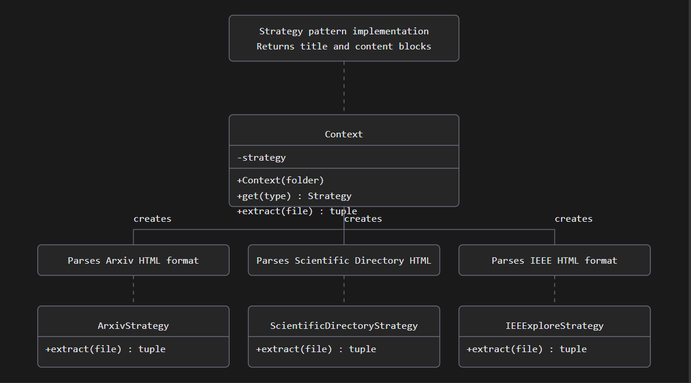
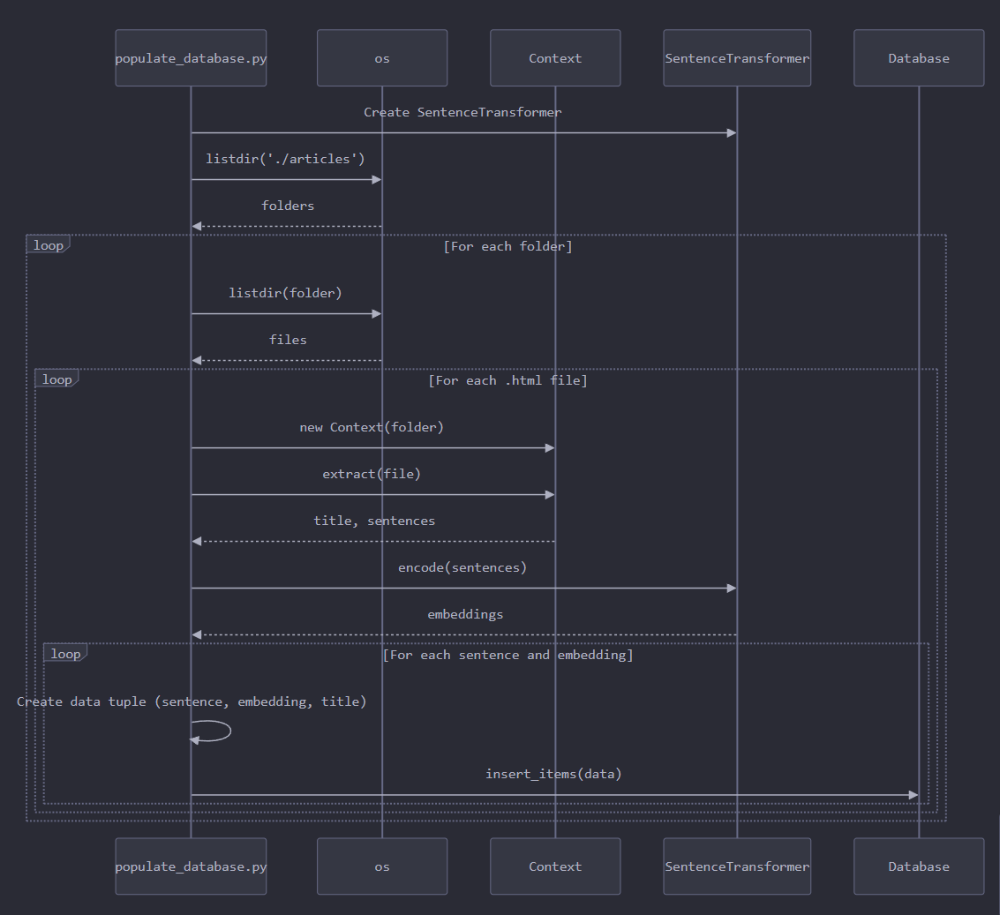

# RAG

## Description
This folder contains the initial experiments with the basic_rag files available [at this link](https://github.com/ricardoaraujo/ppgc_rag/blob/main/rag_basico.zip), where the goal was to learn the basic structure of a RAG system.

Nevertheless, this folder was maintained because the files **populate_database.py** and **parser.py** are still used to create embeddings and store them in the database. Additionally, the articles folder is where the organizational structure was created for articles that will be parsed and inserted into the database.

## How it Works

### parser.py
This file implements the Strategy design pattern. This pattern is useful as it allows us to switch execution algorithms through a common interface. Furthermore, it makes it very simple to add new extraction strategies.

Below is a diagram illustrating the Strategy pattern in the context of this file.

### populate_database.py
This file is responsible for populating the database, and to do this, it reads all HTML files within the articles folder and uses the folder name to instantiate the correct extraction function for each file.

Below is a diagram illustrating the database population process.

